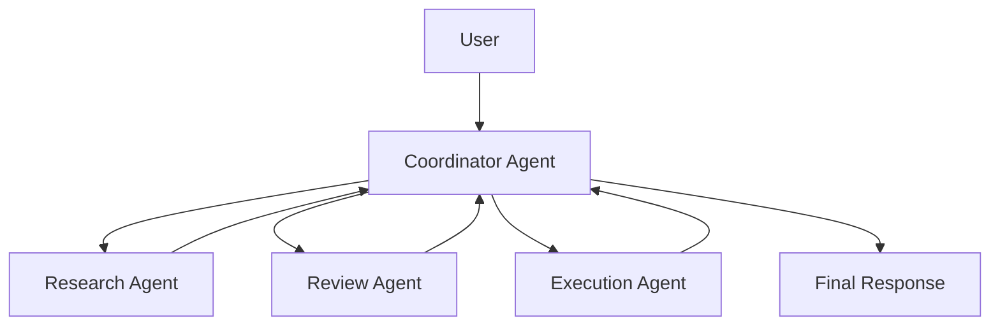

# Prompt: Convert a Technical Video Transcript Into a Textbook-Style Chapter

Turn the attached transcript into a complete textbook-style chapter for a professional software engineer.

The textbook must teach the subject deeply enough that I can understand it without watching the original video.

Do not create ordinary notes or a shallow summary.

Transform the transcript into structured teaching material.

---


## Video Information

Provide and preserve the following source details at the beginning of the textbook chapter:

- **Video Title:** {{VIDEO TITLE}}
- **Speaker or Channel:** {{SPEAKER OR CHANNEL NAME}}
- **Video URL:** {{YOUTUBE VIDEO URL}}
- **Date Watched:** {{DATE}}
- **Main Topic:** {{MAIN TOPIC}}

The video URL must appear as a clickable Markdown link in the final chapter, using this format:

```markdown
**Source Video:** [Watch the original video]({{YOUTUBE VIDEO URL}})
```

If the URL is not provided, write:

> Video URL not provided.

Do not invent or guess the video URL.

---

## Requirements

### 1. Remove Irrelevant Transcript Content

Remove:

- Filler words
- Repetition
- Jokes that do not contribute to understanding
- False starts
- Irrelevant conversation
- Event logistics
- Tool-usage commentary that does not contribute to the lesson
- Unnecessary personal remarks
- Repeated explanations

Preserve analogies, demonstrations, stories, or questions only when they improve understanding of an important concept.

---

### 2. Preserve Important Technical Content

Preserve every important:

- Concept
- Definition
- Explanation
- Workflow
- Architecture pattern
- Code idea
- Example
- Warning
- Trade-off
- Limitation
- Failure mode
- Testing consideration
- Security consideration
- Operational consideration
- Speaker uncertainty
- Professional recommendation
- Tool or framework reference
- Implementation detail
- Design decision
- Rejected alternative
- Reason behind a recommendation

Do not omit important context merely to make the output shorter.

---

### 3. Reorganize the Material

Do not follow the transcript chronologically.

Reorganize the content into logical textbook chapters and sections based on topic and dependency.

Group related ideas together.

Present foundational ideas before advanced ideas.

---

### 4. Begin With the Following

Include:

- Chapter title
- Chapter overview
- Prerequisites
- Learning objectives
- Key terminology
- Estimated difficulty level
- Intended audience
- What the learner should understand by the end

---

### 5. Explain Every Important Concept Fully

For every important concept, provide:

- Formal definition
- Plain-language explanation
- Why it matters
- How it works
- Where it fits in the larger system
- Step-by-step process
- Practical example
- Example from the transcript
- Architecture relevance
- Benefits
- Limitations
- Common mistakes
- When to use it
- When not to use it
- Related concepts
- Important distinctions
- Production implications

Do not simply repeat the speaker’s wording.

Rewrite the explanation so it is suitable for a textbook.

---

### 6. Include Architecture Diagrams

Use Mermaid diagrams where appropriate.

Example:



Use plain-text diagrams when Mermaid would not explain the idea clearly.

---

### 7. Include Visual Explanations

Add visual explanations for concepts that benefit from diagrams.

Include diagrams for:

- Hub-and-spoke architecture
- Coordinator task lifecycle
- Task decomposition
- Dynamic-routing decision tree
- Research partitioning
- Refinement loop
- Observability flow
- Error-handling flow
- Sequential delegation
- Parallel delegation
- Context flow between agents
- Result aggregation

For every visual, explain what it shows and why it matters.

---

### 8. Recommend Images Where Necessary

Where a real illustration would improve understanding, provide an image recommendation.

For every recommended image, include:

- Image title
- What the image should show
- Where it should appear
- Why it improves understanding
- Suggested caption
- Suggested alt text

Do not add images merely for decoration.

---

### 9. Include Clean Code Examples

Include complete, clean, educational, and executable code examples where supported by the transcript.

Do not copy incomplete or messy experimental code directly from the transcript.

Rewrite it into clear examples.

Add code examples for:

- Coordinator agent
- Specialist or spoke agents
- Task decomposition
- Dynamic routing
- Static routing
- Result aggregation
- Research partitioning
- Refinement loops
- Maximum iteration limits
- Logging
- Observability
- Error handling
- Retry handling
- Timeouts
- Agent registration
- Sequential execution
- Parallel execution
- Output validation

---

### 10. Explain Every Code Example

For every code block:

- Explain what the code does
- Explain important lines
- Explain inputs
- Explain outputs
- Identify dependencies
- Explain control flow
- Explain error handling
- Explain security concerns
- Explain testability
- Explain production improvements
- Explain limitations

Do not include unexplained code.

---

### 11. Distinguish Important Architectural Concepts

Clearly distinguish:

- Coordinator responsibilities
- Sub-agent responsibilities
- Code-driven routing
- Model-driven routing
- Static routing
- Dynamic routing
- Sequential execution
- Parallel execution
- One-shot execution
- Refinement loops
- Hub-and-spoke communication
- Peer-to-peer communication
- Decomposition
- Delegation
- Aggregation
- Evaluation
- Observability

---

### 12. Include Comparison Tables

Create comparison tables for:

- Hub-and-spoke vs. peer-to-peer agents
- Static vs. dynamic routing
- Sequential vs. parallel delegation
- Narrow vs. comprehensive decomposition
- One-shot execution vs. refinement loops
- Code-driven vs. model-driven orchestration
- Centralized vs. decentralized observability
- Fixed agents vs. dynamically selected agents

Use columns such as:

| Comparison Area | Option A | Option B |
|---|---|---|
| Definition | | |
| Purpose | | |
| Strengths | | |
| Limitations | | |
| Best Use Case | | |
| Risks | | |
| Example | | |

---

### 13. Add Professional Callouts

Use callout sections such as:

> **Engineering Warning**

> **Security Warning**

> **Performance Note**

> **Cost Consideration**

> **Production Recommendation**

> **Common Mistake**

> **Testing Note**

> **Architecture Insight**

Use them only where they add real value.

---

### 14. Include a Complete Implementation Walkthrough

Include:

- Project objective
- Project structure
- Installation commands
- Dependencies
- Environment setup
- Source code
- Configuration
- Execution commands
- Expected output
- Troubleshooting guidance
- Testing approach
- Security considerations
- Production improvements

Use this sample structure where appropriate:

```text
multi-agent-system/
├── main.py
├── coordinator.py
├── agents/
│   ├── researcher.py
│   ├── reviewer.py
│   └── evaluator.py
├── routing/
│   └── router.py
├── observability/
│   └── logger.py
├── tests/
│   ├── test_coordinator.py
│   ├── test_routing.py
│   └── test_agents.py
├── requirements.txt
└── README.md
```

---

### 21. Include Testing Guidance

Cover:

- Unit testing
- Integration testing
- End-to-end testing
- Routing tests
- Agent failure tests
- Retry tests
- Timeout tests
- Infinite-loop prevention
- Output-quality evaluation
- Schema validation
- Cost monitoring
- Token monitoring
- Regression testing
- Human evaluation
- Representative test datasets

For every testing category, explain what should be tested and why.

---

### 16. Include Security and Safety Guidance

Cover where relevant:

- Authentication
- Authorization
- Prompt injection
- Data leakage
- Unsafe tool use
- Excessive permissions
- Secret exposure
- Logging sensitive data
- Dependency risk
- Supply-chain attacks
- Hallucinations
- Untrusted agent output
- Human approval gates
- Sandboxing
- Rate limiting
- Audit logging

---

### 17. Include Operational Guidance

Cover:

- Logging
- Monitoring
- Tracing
- Metrics
- Alerts
- Failure recovery
- Retry strategy
- Timeouts
- Idempotency
- Cost control
- Token usage
- Model selection
- Deployment
- Scaling
- CI/CD
- Rollback
- Versioning
- Incident response

---

### 18. Explain Common Failure Modes

For every major failure mode, include:

- Name
- Description
- Root cause
- Symptoms
- Impact
- How to detect it
- How to prevent it
- How to fix it
- Example

Include failure modes such as:

- Narrow task decomposition
- Overlapping agent assignments
- Running every agent unnecessarily
- Infinite loops
- Poor routing
- Weak aggregation
- Missing context
- Excessive context
- Conflicting agent outputs
- Unobservable execution
- Incorrect refinement
- Cost explosion
- Token waste
- Weak evaluation
- Garbage-in, garbage-out

Clearly label failure modes that are professional analysis rather than directly stated by the speaker.

---

### 19. Separate Source Content From Added Analysis

Clearly identify:

- Statements made directly by the speaker
- Professional engineering analysis added for clarity
- Inferences
- Claims requiring verification
- Areas not covered sufficiently in the transcript
- Speaker uncertainty
- Marketing claims
- Personal recommendations

Do not present all statements as universal facts.

---

### 20. Add End-of-Chapter Learning Material

Include:

- Chapter summary
- Key takeaways
- Important terms
- Review questions
- Short-answer questions
- Long-answer questions
- Scenario questions
- Coding exercises
- Architecture exercises
- Debugging exercises
- Multiple-choice questions
- Answers and explanations
- Active-recall questions
- Flashcards
- Further study topics
- Practical project ideas

---

### 21. Flashcard Format

Create flashcards using exactly this format:

```text
Q1. {{QUESTION}} :: {{ANSWER}}
Q2. {{QUESTION}} :: {{ANSWER}}
Q3. {{QUESTION}} :: {{ANSWER}}
```

Requirements:

- Do not leave blank lines between flashcards.
- Use `{{double curly braces}}` around the most important answer term.
- Cover definitions, comparisons, workflows, tools, risks, and architecture.

---

### 22. Multiple-Choice Question Format

Use this format:

```text
Question 1

{{QUESTION}}

A. {{OPTION}}
B. {{OPTION}}
C. {{OPTION}}
D. {{OPTION}}

Correct answer: {{ANSWER}}

Explanation:
{{EXPLANATION}}

Why the other options are incorrect:
A. {{EXPLANATION}}
B. {{EXPLANATION}}
C. {{EXPLANATION}}
D. {{EXPLANATION}}
```

Generate enough questions to test real understanding rather than wording memorization.

---

### 23. Include a Teach-Back Section

Explain the topic as if teaching an intelligent beginner.

The teach-back section must:

- Avoid unnecessary jargon
- Preserve technical accuracy
- Explain why the topic matters
- Explain the main workflow
- Include a practical example
- Explain major risks
- Explain the architecture in simple terms

---

### 24. Add a One-Page Revision Summary

Include:

- Core thesis
- Five most important concepts
- Key workflow
- Main architecture
- Important distinctions
- Main risks
- Main tools
- Final memory statement

---

### 25. Make the Textbook Useful For

The final chapter must be useful for:

- Self-study
- Professional software-engineering training
- Technical interviews
- Exams
- AI-agent implementation
- Architecture design
- Team onboarding
- Future professional reference
- Teaching others

---

## Required Chapter Structure

Use the following structure where relevant:

# {{CHAPTER TITLE}}

## Chapter Overview

## Prerequisites

## Learning Objectives

## Key Terminology

## 1. Introduction

## 2. Core Problem

## 3. Central Architecture

## 4. Coordinator Agent

## 5. Specialist Agents

## 6. Task Decomposition

## 7. Task Delegation

## 8. Static and Dynamic Routing

## 9. Sequential and Parallel Execution

## 10. Result Aggregation

## 11. Narrow Task Decomposition

## 12. Research Partitioning

## 13. Refinement Loops

## 14. Observability

## 15. Error Handling

## 16. Security and Safety

## 17. Cost and Performance

## 18. Complete Implementation Walkthrough

## 19. Testing Strategy

## 20. Common Failure Modes

## 21. Production Recommendations

## 22. Professional Analysis

## 23. Chapter Summary

## 24. Key Takeaways

## 25. Review Questions

## 26. Coding Exercises

## 27. Architecture Exercises

## 28. Multiple-Choice Questions

## 29. Active-Recall Questions

## 30. Flashcards

## 31. Teach-Back Exercise

## 32. Further Study

## 33. One-Page Revision Summary

---

## Output Requirements

1. Produce the entire result in valid Markdown.
2. Use clear headings and subheadings.
3. Use tables where comparisons improve understanding.
4. Use Mermaid diagrams for architecture and workflows where appropriate.
5. Use plain-text diagrams when they are clearer.
6. Use syntax-highlighted code blocks.
7. Preserve technical depth.
8. Do not invent unsupported claims.
9. Label speaker opinions and uncertain claims.
10. Explain concepts in professional and plain language.
11. Do not omit major concepts merely because the output becomes long.
12. Explicitly identify missing information.
13. Create a downloadable `.md` file containing the complete textbook chapter.
14. Include the original video URL near the top of the chapter as a clickable Markdown link.
15. Use a lowercase kebab-case filename based on the chapter title.
15. Ensure the final result is understandable without the original video.
16. Ensure every code example is explained.
17. Ensure every diagram is explained.
18. Ensure examples are realistic and educational.
19. Avoid unnecessary repetition.
20. End with a final comprehension checklist.

---

## Video URL

```text
{{YOUTUBE VIDEO URL}}
```

## Source Material

Use the attached transcript as the source.

Do not rely on unsupported external claims unless they are clearly identified and verified.

```text
[USE THE ATTACHED TRANSCRIPT FILE]
```
